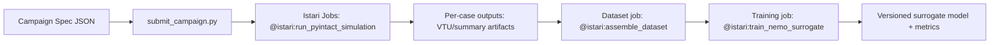

# Architecture: Physics AI Quickstart in Istari

## ASCII Workflow

```text
+--- Outer Dev Loop: Istari -- version - lineage - compare -----------------------------+
|                                                                                       |
|  +- Inner Dev Loop 1 --------+  +- Inner Dev Loop 2 --------+  +- Inner Dev Loop 3 -+ |
|  | PyIntact: Sim Campaign    |  | Dataset: Build Training   |  | PhysicsNeMo: Train  | |
|  | (Simulation Engineer)     |  | Set (Data/ML Engineer)    |  | Surrogate (ML Eng)  | |
|  +-------------+-------------+  +-------------+-------------+  +-------------+--------+ |
|                |                              |                              |          |
|                v                              v                              v          |
+-----------------------------------------------------------------------------------------+
| Outer-loop gates in Istari: throughput <-> data quality <-> model quality              |
| --> Readiness report: PASS / FAIL per gate                                              |
+-----------------------------------------------------------------------------------------+
```



## Control Plane

- Local notebook/scripts: campaign design, dispatch, monitoring
- Istari: execution, artifact storage, lineage, versioning

## Data Plane

- Inputs: geometry models + parameter grid
- Mid artifacts: PyIntact result files and metadata
- Output: PhysicsNeMo model revision with validation report
