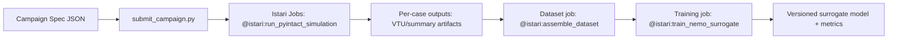

# Architecture: Physics AI Quickstart in Istari

## ASCII Workflow

```text
Campaign spec
  |
  v
submit_campaign.py
  |
  v
@istari:run_pyintact_simulation (many jobs)
  |
  v
Per-case VTU + summary artifacts
  |
  v
@istari:assemble_dataset
  |
  v
@istari:train_nemo_surrogate
  |
  v
Versioned surrogate model + metrics + lineage
```



## Control Plane

- Local notebook/scripts: campaign design, dispatch, monitoring
- Istari: execution, artifact storage, lineage, versioning

## Data Plane

- Inputs: geometry models + parameter grid
- Mid artifacts: PyIntact result files and metadata
- Output: PhysicsNeMo model revision with validation report
